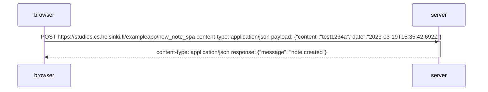

```mermaid
sequenceDiagram
    participant browser
    participant server

    browser->>server: POST https://studies.cs.helsinki.fi/exampleapp/new_note_spa content-type: application/json payload: {"content":"test1234a","date":"2023-03-19T15:35:42.692Z"} 
    activate server
    server-->>browser: content-type: application/json response: {"message": "note created"}
    deactivate server

```
